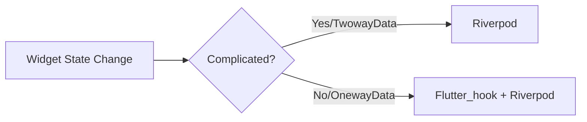
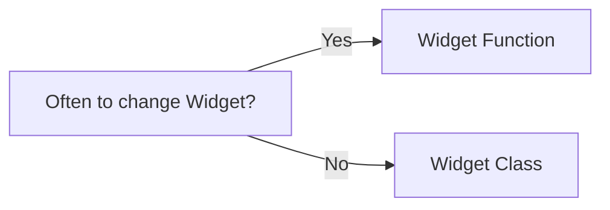

Choose your language: - [English](./en/README.md) - [日本語](./jp/README.md)

# How to run this project :sunglasses:
Step1
```
flutter pub get
```
Step2 -> if .g/.freeze didn't generated
```
flutter pub run build_runner build 
```
Step3 -> choose config prod/dev at lib.main
```
main_dev.dart / main_prod.dart
```
Step4 -> change Token to 'Your Api token' in app_env.dart
```
AppEnvironment.dev: 'Your Api token',
AppEnvironment.prod: 'Your Api token',
```

# Step for dev
1. Checking doc of Github api [search/repository](https://docs.github.com/en/rest/search/search?apiVersion=2022-11-28#search-repositories) , [query detail of "search/repository"](https://docs.github.com/en/search-github/searching-on-github/searching-for-repositories)
2. Check device version setting
- [X] Andriod Versiono Setting (sdk 19 ~ 32 only)
- [X] iOS Veresion Setting (min versino only)

3. Main third-party: riverpod + flutter-hook + mocktail + retrofit + Dio

# Rule of coding

1. lint -> flutter_lints
2. commit style -> [Conventional Commits 1.0.0](https://www.conventionalcommits.org/en/v1.0.0/)
   ```
   [optional scope]: <description> [emoji][emoji][emoji]

   [optional body]
   ```

# How to work with flutter_hook + riverpod



# Widget Function VS Widget Class


# Fatal Bug Recode
1. Facing Dio bug [link](https://pub.dev/documentation/dio/latest/dio/RequestOptions/uri.html)
```dart
final query = Transformer.urlEncodeQueryMap(queryParameters, listFormat);
```
Top line will force encode queryParameters. So we need to rewrite it to fix it