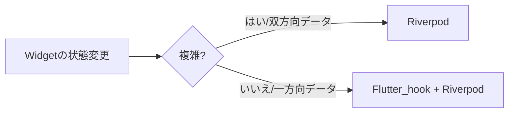
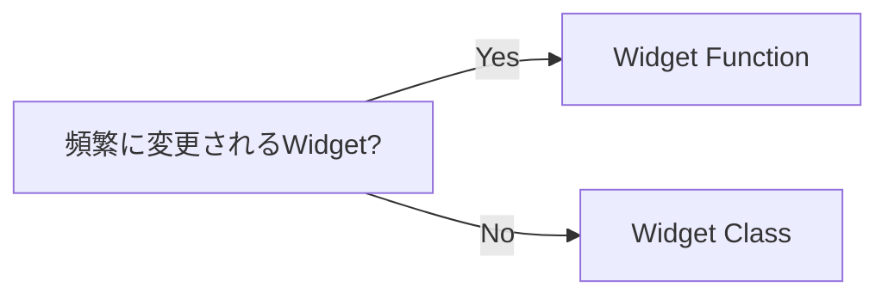

言語: - [English](./en/README.md) - [日本語](./jp/README.md) 

# このプロジェクトの実行方法 :sunglasses：
ステップ1
```
flutter pub get
```
Step2 -> .g/.freeze が生成されなかった場合
```
flutter pub run build_runner build 
```
ステップ3 -> lib.mainでprod/devの設定を選択する。
```
main_dev.dart / main_prod.dart
```
Step4 -> トークンを Github Api トークンに変更する。
```
const String token = 'YOUR GITHUB TOKEN';  //lib/share/api/provider/api_provider.dart
```

# 開発ステップ
1. Github apiのドキュメントをチェックする [search/repository](https://docs.github.com/en/rest/search/search?apiVersion=2022-11-28#search-repositories) , [search/repository クエリ詳細](https://docs.github.com/en/search-github/searching-on-github/searching-for-repositories)
2. 端末のバージョン確認
- [X] Andriod バージョン設定 (sdk 19 ~ 32 のみ)
- [X] iOSバージョン設定(最小バージョンのみ)

3. 主なサードパーティ: riverpod + flutter-hook + mocktail + retrofit + Dio

# コーディングのルール

1. lint -> flutter_lints
2. コミットスタイル -> [Conventional Commits 1.0.0](https://www.conventionalcommits.org/en/v1.0.0/)
   ```
	[optional scope]: <description> [emoji][emoji][emoji]  
  
	[optional body]
   ```

# flutter_hook + riverpod との連携方法



# ウィジェット関数 VS ウィジェットクラス



# バグ FIX
1. Dioのバグ [link](https://pub.dev/documentation/dio/latest/dio/RequestOptions/uri.html)
```dart
final query = Transformer.urlEncodeQueryMap(queryParameters, listFormat);
```
上記の行は `queryParameters` を強制的にエンコードします。そのため、修正のために再度書き換える必要があります。